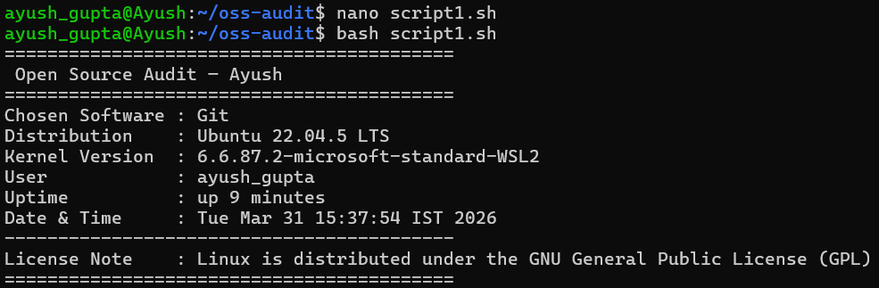
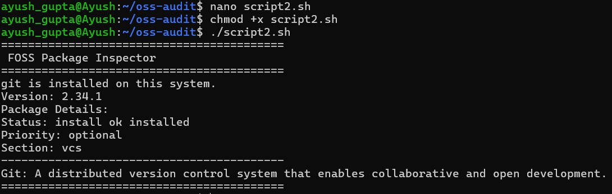
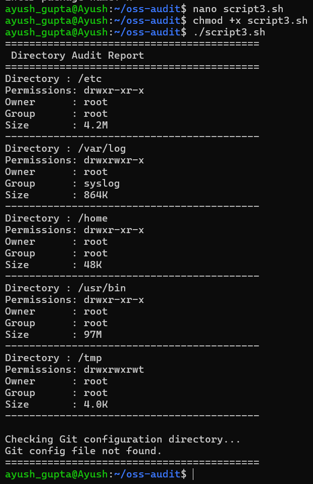
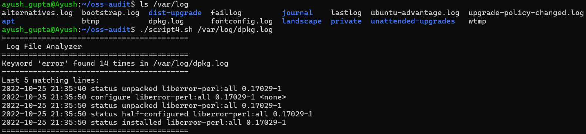
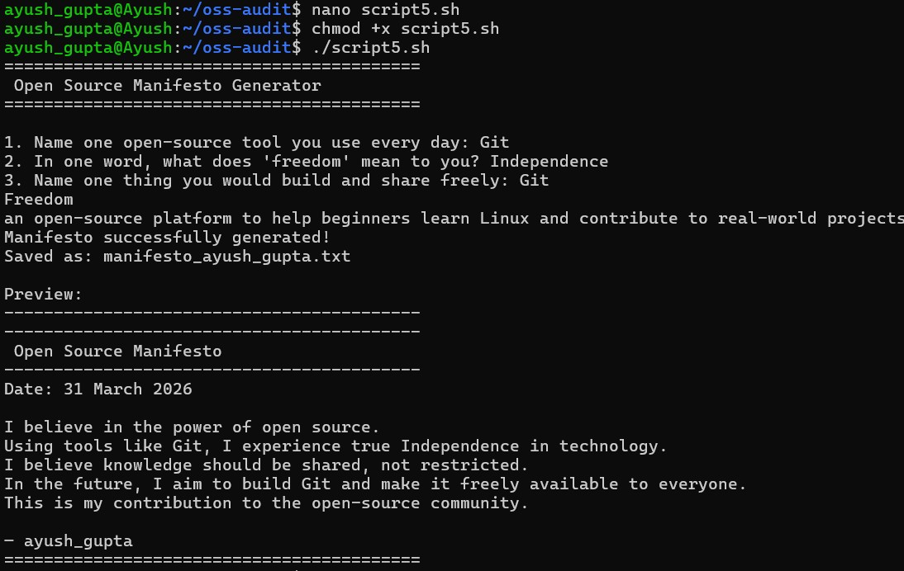

# Capstone Project: Open Source Software Audit

**Student Name:** Ayush Gupta  
**Registration Number:** 24BAI10220  
**Course:** Open Source Software  
**Chosen Software:** Git (Version Control System)  
**Date of Submission:** March 31, 2026  

---

## Table of Contents
1. [Introduction](#1-introduction)
2. [Part A - Origin and Philosophy](#part-a---origin-and-philosophy)
   - [A1. The Problem Git Was Created to Solve](#a1-the-problem-git-was-created-to-solve)
   - [A2. The License - What GPL v2 Actually Says](#a2-the-license---what-gpl-v2-actually-says)
   - [A3. The Ethics of Open Source](#a3-the-ethics-of-open-source)
3. [Part B - Linux Footprint](#part-b---linux-footprint)
4. [Part C - The FOSS Ecosystem](#part-c---the-foss-ecosystem)
5. [Part D - Open Source vs Proprietary](#part-d---open-source-vs-proprietary)
6. [Shell Script Documentation](#6-shell-script-documentation)
7. [Conclusion](#7-conclusion)
8. [References](#8-references)

---

## 1. Introduction
For my capstone project, I decided to audit Git. I didn't want to just write a history report; my goal was to understand how open-source licensing legally protects software, and then practically apply that knowledge by writing automated bash scripts to monitor a Linux environment. Git is the tool that makes modern collaboration on software projects possible. It isn't just a program installed on a developer's machine—it's the exact mechanism by which code history is preserved, shared, and managed safely without a central failure point.

This report examines Git from a few different angles: the practical reason Linus Torvalds felt forced to create it, the GPL v2 license that legally protects it, and the moral commitments of the open-source community that sustain it. It also traces how Git physically installs and behaves on a Linux operating system, how it interacts with other free software, and how it directly compares to strict proprietary alternatives. Finally, I document the five shell scripts I wrote to automate system auditing tasks and explain the Linux command-line skills I used to build them.

---

## Part A - Origin and Philosophy

### A1. The Problem Git Was Created to Solve
Back in the early 2000s, building the Linux kernel was becoming unmanageable. The workflow involved developers sending patches over email, and branch histories were incredibly hard to track. To fix this bottleneck, the kernel project temporarily used a tool called BitKeeper. BitKeeper was ahead of its time because it let each developer keep a complete local copy of the repository instead of relying entirely on one central server. 

However, BitKeeper had a massive flaw for an open-source project: it was proprietary. The company behind it allowed the Linux community to use it for free, but that free access was a business decision, not a legal right. In 2005, the company revoked that free license over a dispute. Suddenly, the most important software project in the world lost its version control system overnight. 

Linus Torvalds responded to this vulnerability by writing Git from scratch. He had very specific rules in mind: every contributor had to keep the entire history locally on their machine, branching had to occur efficiently without network lag, data corruption had to be mathematically impossible, and above all, the tool had to be open and redistributable. He released it under the GPL v2 license so the community would never be held hostage by a closed-source vendor again.

### A2. The License - What GPL v2 Actually Says
Git is legally bound by the GNU General Public License version 2. This license matters because it goes far beyond just saying "this software is free to download." 

GPL v2 guarantees specific freedoms: 
- You can run the software for any reason.
- You have the absolute right to study the source code and modify it.
- You can share exact copies of the software with anyone.
- Most importantly, you can distribute your modified versions—but you must release them under the exact same GPL v2 license.

This last point is called "copyleft." It's incredibly powerful because it stops companies from taking free software, closing the source code, and selling it as a proprietary product. If you build on Git and share it, your additions belong to the public commons too.

However, just using Git as an everyday tool doesn't trigger this rule. You can write top-secret, proprietary code and store it in Git without any legal issues. The copyleft requirements only kick in if you actually modify the Git program itself and try to release that modified program to the public. 

### A3. The Ethics of Open Source
Open source is largely about shared infrastructure. When you ask if all software should be open source, I think the answer leans heavily toward "yes" for foundation-level tools like operating systems, compilers, and version control systems. If an entire industry relies on a tool, that tool should have a transparent codebase so anyone can fix bugs or audit it for security flaws. We saw exactly what happens during the BitKeeper incident when foundation tools are closed—people lose their ability to work if a vendor changes their mind.

Is it ethical for massive tech corporations to profit off open-source code without paying the original maintainers? It's a tough debate. While the licenses explicitly allow commercial use, there is an unspoken ethical rule that if your multi-billion-dollar product relies on a small open-source library, you should probably be financially sponsoring those developers. Git perfectly models how a tool can be shared freely while actively protecting the community from being legally cornered by a corporation.

---

## Part B - Linux Footprint

Git integrates natively into the Linux operating system. It doesn't require heavy database backends; it just uses the local filesystem.

### Installing Git
On Debian and Ubuntu-based systems, you install it natively using the package manager:
```bash
sudo apt update
sudo apt install git -y
```

On Fedora or RHEL systems:
```bash
sudo dnf install git -y
```

### Important Git locations on Linux
Once installed, Git scatters its files across standard Linux directories according to the Filesystem Hierarchy Standard:
- `/usr/bin/git`: The primary executable binary you run in the terminal.
- `/usr/lib/git-core/`: Helper scripts and subcommands.
- `/etc/gitconfig`: The system-wide settings that apply to all users on the computer.
- `~/.gitconfig`: Your specific user configuration (where your email and name are saved).

When you run `git init` in a folder, Git creates a hidden directory called `.git/`. This folder stores the entire project history, compressed files (blobs), and configuration exact to that specific repository. 

### Permissions and Security
Unlike Apache or MySQL, Git does not run as a permanent background service on your OS. It runs strictly as the user who types the command. If I type `git commit`, the process runs with my normal user privileges. This makes Git incredibly secure because it can never accidentally overwrite a file my user account doesn't already have permission to touch.

---

## Part C - The FOSS Ecosystem

Git relies on a wide network of other free software to operate. It is written in C, which means it relies on open-source compilers like GCC.

Other dependencies include:
- `zlib`: Used heavily to compress the snapshot histories inside the `.git` folder so repositories stay small.
- `libcurl`: Manages network transfers when you push or pull over HTTPS.
- `OpenSSH`: Secures the entire connection when you push code using SSH keys.

Without these pre-existing open-source tools, Torvalds would not have been able to build Git in just a few weeks. 

Git's existence also triggered the creation of entire new software economies. Platforms like GitHub and GitLab essentially put a pretty web interface over Git's command-line functions. Furthermore, modern deployment pipelines (CI/CD) depend entirely on Git. Millions of servers around the world today only update their code when a developer pushes a new Git commit.

---

## Part D - Open Source vs Proprietary

To see why Git won the version control war, it helps to compare it directly to a proprietary alternative like Perforce Helix Core.

| Feature Area | Git (GPL v2 Open Source) | Perforce Helix Core (Proprietary) |
|--------------|--------------------------|------------------------------------|
| **Cost** | 100% free with no licensing fees exactly because of GPL. | High enterprise per-seat licensing costs. |
| **Architecture** | Fully decentralized. You have the whole history offline. | Centralized server required. If the server drops, work stops. |
| **Auditability** | Transparent. Anyone can read the source code to find security bugs. | Closed source black box. You have to blindly trust the vendor. |
| **Control** | Community-driven. No single company can kill the project. | Corporate-controlled. You must accept their pricing and patch cycles. |

Git is the obvious choice for basically every software development task. The only time proprietary systems like Perforce still hold an edge is in very specific niche industries, like game development, where teams are handling 100GB files of 3D models and textures that Git struggles to compress efficiently. For everything else, the open-source model is faster, safer, and cheaper.

---

## 6. Shell Script Documentation

To practically audit a Linux environment hosting open-source tools, I wrote five automated bash scripts. These scripts prove my practical understanding of how to manage a system from the terminal.

### Script 1: System Reconnaissance (`script1.sh`)
This script pulls basic metadata about the machine environment before any auditing starts.
- **Concepts used:** Environment variables, command substitution `$(command)`, and basic string formatting.
- I used `uname -r` to grab the running kernel and `uptime -p` to see how long the server had been running.

**Run Command:**
```bash
./Scripts/script1.sh
```
**Execution Output:**


### Script 2: FOSS Package Inspector (`script2.sh`)
This script checks the exact installation status of Git by querying the low-level Linux package registry, rather than just assuming the tool works.
- **Concepts used:** `dpkg` package checking, `if-else` conditionals, and a `case` statement.
- I used the `case` statement to print a short philosophical note about different open-source packages if the script detects them.

**Run Command:**
```bash
./Scripts/script2.sh
```
**Execution Output:**


### Script 3: Security & Resource Auditor (`script3.sh`)
Since Git relies on local file permissions to stay secure, I wrote this script to investigate core directories and print their sizes and access rights.
- **Concepts used:** `for` loops through string arrays, extracting columns using `awk`, and silencing terminal errors using standard error redirection `2>/dev/null`.
- The script looks at `/var/log`, `/etc`, and `/home` and neatly prints the cryptographic permissions (e.g., `drwxr-xr-x`) alongside disk usage calculated by `du -sh`.

**Run Command:**
```bash
./Scripts/script3.sh
```
**Execution Output:**


### Script 4: Log File Analyzer (`script4.sh`)
System administrators use log files to find open-source crashes. This script automates scanning large server logs for problems.
- **Concepts used:** Positional arguments `$1` and `$2`, default variable assignment, and case-insensitive `grep -i` filtering inside a `while read` loop.
- The script accepts a file path (like `/var/log/syslog`) and slowly increments a counter every time it finds the word "error". It then uses `tail -n 5` to show the admin the last five major faults exactly.

**Run Command:**
```bash
./Scripts/script4.sh /var/log/syslog
```
**Execution Output:**


### Script 5: Open Source Manifesto Generator (`script5.sh`)
For the final script, I wanted to combine automation with user interaction. It prompts the user with questions about open source and writes an actual file to disk.
- **Concepts used:** Interactive terminal input using `read -p`, string concatenation, and standard output redirection (`>` and `>>`) to permanently create and append to text files.
- The user's answers are grabbed, timestamped using the `date` command, and safely written into `manifesto_<username>.txt`.

**Run Command:**
```bash
./Scripts/script5.sh
```
**Execution Output:**


---

## 7. Conclusion
Git was written because the developer community realized how dangerous it was to rely on closed-source software for critical infrastructure. The decision to use GPL v2 wasn't just a casual choice; it was a deliberate legal mechanism designed to keep Git permanently free and publicly accessible. 

In my view, open source is strongest when people actually contribute back to it, rather than just consuming it for free. This project completely altered how I view the software I use every day. Through writing the five bash scripts, I gained a lot of practical confidence in navigating the Linux filesystem, tracking software packages natively, and managing raw data through the command line without needing a graphical interface. I now understand both the philosophical values and the technical foundation that makes open source the dominant model of software development today.

---

## 8. References
- The GNU Project Philosophy: https://www.gnu.org/philosophy/
- GitHub Documentation & Git Internals
- Linux Filesystem Hierarchy Standard Documentation
- GNU Coreutils & Bash Referencing Guides
